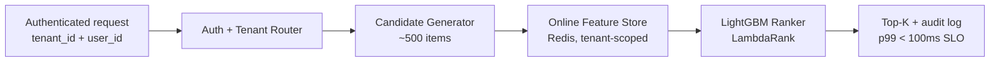
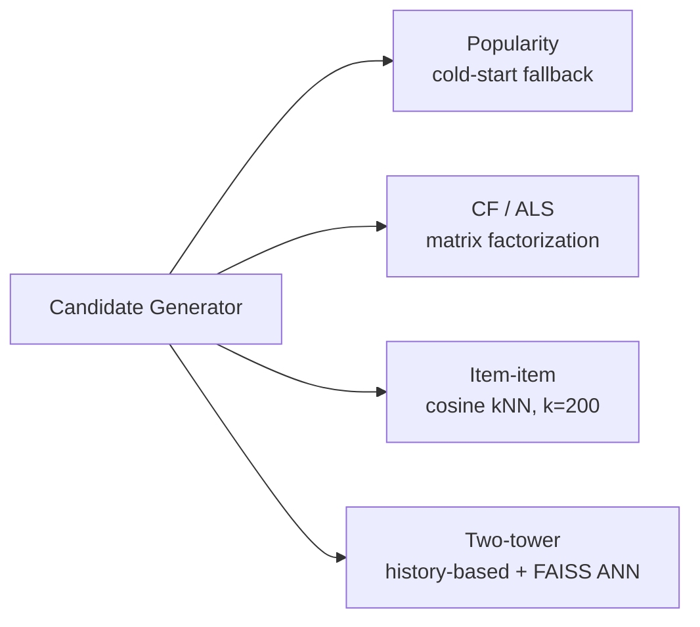

# MovieLens Two-Stage Recommender

A two-stage movie recommender on MovieLens 25M, built end-to-end with the engineering discipline of a production ML platform — ADR-gated decisions, time-respecting splits, stage-specific evaluation, and per-policy attribution. The point is the engineering around the model, not the leaderboard.

**Status:** Phase 1 (foundation) complete · Phase 2 (two-stage offline) complete · Phase 3 (serving, auth, multi-tenancy) in progress.

## Architecture

The target system is a two-stage candidate-generator + ranker pipeline behind authenticated, multi-tenant serving. Phase 2 builds the offline modeling half; Phase 3 builds the serving and isolation half.


```mermaid
flowchart LR
    R[Authenticated request<br/>tenant_id + user_id] --> AR[Auth + Tenant Router]
    AR --> CG[Candidate Generator<br/>~500 items]
    CG --> FS[Online Feature Store<br/>Redis, tenant-scoped]
    FS --> RK[LightGBM Ranker<br/>LambdaRank]
    RK --> RESP[Top-K + audit log<br/>p99 &lt; 100ms SLO]
```

The candidate stage has multiple implementations selected via per-tenant champion routing:


```mermaid
flowchart LR
    CG[Candidate Generator] --> POP[Popularity<br/>cold-start fallback]
    CG --> CF[CF / ALS<br/>matrix factorization]
    CG --> II[Item-item<br/>cosine kNN, k=200]
    CG --> TT[Two-tower<br/>history-based + FAISS ANN]
```

Each candidate model is scored on **recall@500** against a temporal holdout; the ranker is scored on **NDCG@10** against the same holdout after ranking the 500 survivors. Both metrics are produced by a single evaluation harness so candidate-stage and ranker-stage numbers are never confused with end-to-end numbers.

## Current phase status

The status reflects what is actually merged on `main`, not what is planned.

| Phase | Scope | Status |
|---|---|---|
| 1 — Foundation | MovieLens 25M ingestion, DVC, MLflow, evaluation harness, temporal split, popularity + CF baselines | **Complete** |
| 2 — Two-stage architecture (offline) | Item-item, two-tower, feature module, LightGBM ranker, stage-specific metrics | **Complete** |
| 3 — Serving, auth, multi-tenancy, synthetic-load | Feast, FastAPI, Redis, OAuth/JWT auth, per-tenant isolation, synthetic-user harness for load + cold-start coverage | **In progress** — the repeatable demo serves item-item candidates through Feast + LightGBM, persists RLS-scoped prediction audits, and enforces an authenticated k6 p99 gate; the server-side browser session/E2E, programmatic cold-start cohorts, and environment-specific Compose remain |
| 4 — Orchestration + promotion gate | Prefect DAGs, automated evaluation gate, model registry promotion | Planned |
| 5 — Monitoring + drift | Per-tenant Grafana, Evidently drift detection, synthetic drift simulation | Planned |
| 6 — A/B + shadow deploys | Tenant-aware champion/challenger routing, statistical significance | Planned |

## Why this exists / what's interesting

Most public recsys repos are notebooks that train a model and report a number. This repo is structured to look like a system, not an experiment. The artifacts worth looking at first:

- **[Design decisions (ADRs)](docs/adr/)** — every significant choice is written down with alternatives and consequences. Recruiters: [ADR 0001 (evaluation protocol)](docs/adr/0001-evaluation-protocol.md) is the strongest single entry point.
- **[Working demo plan](docs/demo-plan.md)** — the concrete Phase 3 vertical-slice sequence, definition of done, walkthrough, and remaining delivery bundles.
- **[Local demo runbook](docs/demo-runbook.md)** — clean-checkout startup, seeding, smoke validation, walkthrough, reset, and troubleshooting.
- **[Movie-discovery frontend plan](docs/frontend/)** — product discovery,
  route contracts, backend readiness, implementation bundles, and finish gate.
- **[Generated API contract](docs/api/)** — committed OpenAPI and generated
  TypeScript types with Python and Node CI drift checks.
- **Time-respecting evaluation** — temporal train/holdout/test split with a fixed cutoff timestamp. No random splits on time-series data, ever.
- **Stage-specific metrics** — the candidate stage is scored on recall over its full retrieval window (recall@500), the ranker on NDCG@10 over its output. Both metrics flow through one harness with `EvalResult.k` stamped on every result so they can't be confused.
- **Per-policy MLflow attribution** — every candidate model embeds a popularity fallback for cold users; per-policy metrics partition the holdout by which routing branch actually served each user. So you know whether the learned model is doing work or the fallback is.
- **A `phase-2-candidates` MLflow experiment** with directly comparable runs across popularity, CF/ALS, item-item, and two-tower — same harness, same holdout, same K.
- **Versioned learned serving artifacts** — a SHA-256-pinned manifest binds the item-item index, LightGBM booster, tenant, and ordered Feast feature contract. The model sidecar loads that bundle once at startup; requests never fit or rebuild models.
- **Durable prediction audits** — every recommendation stores the exact ranked items, scores, online feature values, model versions, fallback reason, and candidate/feature/ranker/total latency behind the same Postgres RLS boundary as serving data.
- **A measured latency contract** — a pinned k6 container drives authenticated warm, cold, and mixed traffic. The 60-second smoke profile gates p99 below 100 ms, zero request errors, correct responses, and more than 50 requests/second in CI.
- **Reproducibility-by-default** — `make train-*` on a fixed seed produces the same model artifact hash. Non-determinism is treated as a bug to find, not tolerate.

## Design decisions

ADRs live under [`docs/adr/`](docs/adr/). Backend ADRs use a flat numeric line; frontend ADRs have their own namespace under [`docs/adr/frontend/`](docs/adr/frontend/).

| # | Decision | Why it matters |
|---|---|---|
| [0001](docs/adr/0001-evaluation-protocol.md) | Evaluation protocol — temporal split, recall@K + NDCG@K, warm/cold slicing, no ad-hoc metrics | Pins the contract every model is scored against, before any model code |
| [0002](docs/adr/0002-implicit-feedback-label.md) | Every rating is a positive interaction; no rating-value threshold | Aligns with production implicit-feedback practice; throws away no signal |
| [0003](docs/adr/0003-two-stage-architecture.md) | Two-stage architecture: candidate generator + ranker | Single-model global scoring blows the p99 < 100ms SLO by 1–2 orders of magnitude |
| [0004](docs/adr/0004-item-item-before-two-tower.md) | Item-item ships before two-tower as the zero-learned-parameters baseline | A learned model needs a baseline to beat or its recall numbers don't mean anything |
| [0005](docs/adr/0005-lightgbm-over-neural-ranker.md) | LightGBM over a neural ranker — tabular features are GBDT's home turf | LambdaRank directly optimizes the per-user ordering the serving stage needs |
| [0006](docs/adr/0006-two-tower-retrieval-architecture.md) | History-based two-tower retrieval with FAISS | Avoids memorizing user IDs and pins the learned retrieval architecture |
| [0007](docs/adr/0007-auth-provider-keycloak.md) | Keycloak OIDC with realm-per-tenant issuers | Makes tenant identity part of the verified token issuer boundary |
| [0008](docs/adr/0008-multi-tenancy-rls.md) | Postgres row-level security | Makes the database reject cross-tenant reads and writes even when application filtering is wrong |
| [0009](docs/adr/0009-feature-store-feast.md) | Feast over direct SQL or a hand-rolled online feature cache | Pins point-in-time historical reads and tenant-keyed Redis serving behind one schema |
| [0010](docs/adr/0010-synthetic-load-k6.md) | k6 for synthetic load | Turns the p99 SLO into an authenticated CI pass/fail contract |
| [0011](docs/adr/0011-cold-start-coverage.md) | Controlled synthetic cold-start cohorts | Makes zero- and short-history behavior measurable by cohort |
| [0012](docs/adr/0012-browser-identity-feedback-and-online-freshness.md) | Browser identity, durable movie state, and online-freshness semantics | Separates actor from demo persona, pins feedback effects, and prevents success before commit |
| [frontend/0001](docs/adr/frontend/0001-frontend-framework.md) | Next.js + Tailwind for the portfolio frontend | Real Server Components, route handlers, image optimization for poster grids |
| [frontend/0002](docs/adr/frontend/0002-movie-discovery-experience.md) | Poster-first movie discovery with progressive ML disclosure | Replaces the rating wall with Discover, Browse, Library, detail, and optional Quick Picks routes |

ADRs are written as substantive documents (typical length 100–180 lines), each treating alternatives with analysis rather than a single rejection sentence and including consequences and second-order effects.

## Non-negotiables (what makes this not a toy)

These are bright-line rules the project is held to. Each maps to a real production failure mode.

1. **Time-respecting splits.** No random splits on temporal data. Ever.
2. **Feature parity test in CI.** Offline-computed feature must match online-served feature for the same user/item. This is the bug that ruins most real recsys deployments.
3. **Cold-start handling.** Explicit fallback for new users (no history) and new movies (no interactions); measured against synthetic cold-start cohorts, not assumed.
4. **Latency SLO.** p99 < 100ms, measured under synthetic load.
5. **Reproducibility test.** `make train` on a fixed seed produces the same model artifact hash. If it doesn't, find what's nondeterministic.
6. **ADRs.** One ADR per significant decision, substantive enough to defend in a design review.
7. **Evaluation gate before promotion.** A model is never promoted without beating the incumbent on holdout — automated, not eyeballed.
8. **Logged predictions and features.** Every online prediction logs the features used, the tenant, the model version, and the latency.
9. **Tenant isolation.** Cross-tenant data leakage is the highest-severity bug class; CI canary tests every endpoint as tenant A and asserts no tenant B data leaks.
10. **Auth on every endpoint except `/healthz`.** No internal unauthenticated paths.
11. **Synthetic-load smoke test in CI.** Every serving PR runs a short load script; p99 over the SLO threshold fails the PR.

The online recommendation path now enforces non-negotiables 2, 4, and 8–11.
The broader Phase 3 work extends the same contracts to its remaining surfaces.

## Stack

| Layer | Choice |
|---|---|
| Models | PyTorch (two-tower), LightGBM (ranker) |
| Candidate-stage classical baselines | `implicit` (ALS + cosine item-item) |
| ANN retrieval | FAISS-CPU (IVF-Flat over cosine-normalized item embeddings) |
| Data store | PostgreSQL |
| Data versioning | DVC |
| Feature store | Feast (Phase 3) |
| Tracking + registry | MLflow |
| Orchestration | Prefect |
| Serving | FastAPI + Redis |
| Auth provider | Keycloak OIDC, realm per tenant |
| Multi-tenancy isolation | PostgreSQL row-level security |
| Synthetic load | k6 |
| Frontend | Next.js + TypeScript + Tailwind |
| Monitoring | Prometheus + Grafana + Evidently |
| Containers | Docker + docker-compose |
| CI/CD | GitHub Actions (ruff, black, mypy `--strict`, pytest) |

## Phase plan (abbreviated)

The full plan with lessons-per-phase lives in the project's design notes. The short version:

- **Phase 1 — Foundation** *(complete)*. Postgres + DVC + MLflow + docker-compose, temporal split per ADR 0001, evaluation harness as single source of truth, popularity + CF/ALS baselines.
- **Phase 2 — Two-stage architecture, offline** *(complete)*. Item-item and two-tower candidate generators, provisional feature module, LightGBM ranker, and stage-specific metrics (recall@500 / NDCG@10) through the same harness.
- **Phase 3 — Serving, auth, multi-tenancy, synthetic-load** *(in progress)*. Keycloak auth, Postgres RLS, tenant routing, Feast-backed online features, learned item-item + LightGBM serving, durable prediction audits, and the authenticated k6 SLO gate are in place. The movie-discovery product contract is documented under [`docs/frontend/`](docs/frontend/); the server-side browser session/E2E, durable multi-state feedback, programmatic cold-start cohorts, generic audits, and environment-specific Compose remain.
- **Phase 4 — Orchestration + promotion gate.** Prefect DAGs, automated evaluation-gated promotion against the incumbent champion.
- **Phase 5 — Monitoring + drift.** Per-tenant Grafana dashboards, Evidently drift detection, synthetic drift simulation that proves the alert path fires.
- **Phase 6 — A/B + shadow deploys.** Tenant-aware champion/challenger routing, shadow-mode logging, statistical significance for online experiments.

## Repo structure

```
docs/
  adr/                  # backend ADRs (flat numeric line)
    frontend/           # frontend ADRs (own numeric line)
  eda.md                # MovieLens 25M exploratory analysis writeup
src/
  data/                 # ingestion, schemas, temporal split
  evaluation/           # single source of truth for metrics (recall@K, NDCG@K, warm/cold slicing)
  models/
    candidates/         # popularity, CF/ALS, item-item, two-tower
    ranker/             # LightGBM LambdaRank
    artifacts.py        # serving manifest + deterministic item-item index
  serving/              # authenticated API, orchestration, feature/model clients, prediction audit
  training/             # offline evaluation plus demo artifact packaging
tests/
  unit/                 # model contracts, eval-protocol coverage
  integration/          # to be expanded in Phase 3
  feature_parity/       # offline/online consistency (Phase 3)
web/                    # Next.js + Tailwind frontend
synthetic/
  personas/             # stable named demo users, catalog manifest, idempotent seeder
  load/                 # authenticated k6 warm/cold/mixed SLO workloads
infra/                  # docker-compose configs, MLflow + Postgres init
```

## Local development

The stack runs on local docker-compose: Postgres, Redis, MLflow (with Postgres backend store), Prometheus, Grafana.

```bash
# one-time
make install              # python deps via pyproject
make infra-up             # docker-compose up: postgres, redis, mlflow, prom, grafana

# fetch + ingest data (one-time, DVC-tracked)
make data-download        # downloads MovieLens 25M
make data-ingest          # ingests into Postgres
make db-migrate           # applies tenant and demo-persona schema

# routine
make lint                 # ruff + black --check
make typecheck            # mypy --strict on src/
make test                 # pytest
make train-popularity     # Phase 1 baseline → MLflow phase-1-baselines
make train-cf             # Phase 1 baseline → MLflow phase-1-baselines
make train-itemitem       # Phase 2 candidate → MLflow phase-2-candidates
```

MLflow UI: <http://localhost:5000>. Grafana: <http://localhost:3000>.

## Working demo

The portfolio walkthrough uses an isolated Compose project and a reviewed mini
catalog, so the 25M dataset is not required:

```bash
cp .env.example .env
make demo-up
make demo-seed
make demo-smoke
make demo-audits
make demo-load-smoke
```

Open <http://localhost:3001>. Select a persona, rate movies from 1–5 stars, and
watch its history and unseen recommendations refresh. Warm personas show the
`item-item-cosine+lightgbm` policy and checksum-pinned model versions; Cold
Start shows the explicit `popularity` fallback. `make demo-audits` prints the
latest exact predictions, features, versions, and stage timings, while
`make demo-load-smoke` runs the 60-second authenticated p99 gate. Use
`make demo-down` to stop while preserving state, `make demo-reset` to recreate
only the demo-owned volumes, and
`make demo-logs` when a dependency fails. See the
[complete demo runbook](docs/demo-runbook.md) for the walkthrough and recovery
steps.

### Optional TMDB posters

The demo works without TMDB credentials and falls back to its MovieLens titles,
genres, and generated artwork. To enable real posters and additional metadata,
create a TMDB API Read Access Token in your TMDB account settings. For the
containerized demo, put it in `.env` before `make demo-up`. For direct FastAPI
development, expose it only to the backend process:

```bash
export TMDB_READ_ACCESS_TOKEN="your-read-access-token"
make serve
```

The token is sent to TMDB as a server-side Bearer credential. It is never
included in recommendation responses or the browser bundle. Successful and
failed lookups are held in a bounded six-hour in-process cache so an upstream
failure does not make recommendations unavailable or trigger repeated calls.
