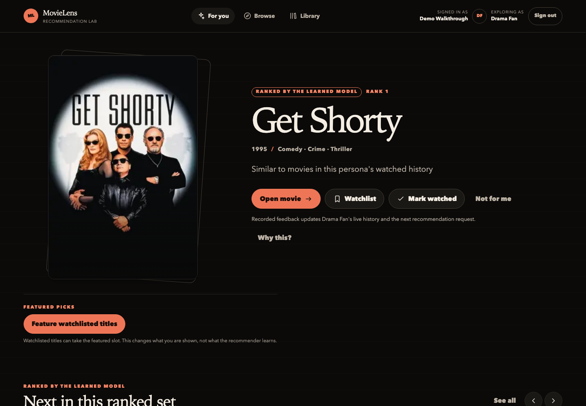
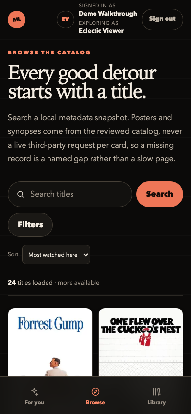
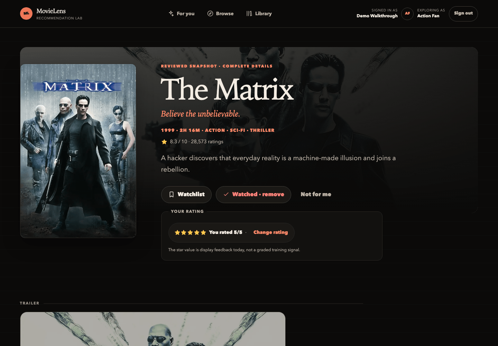
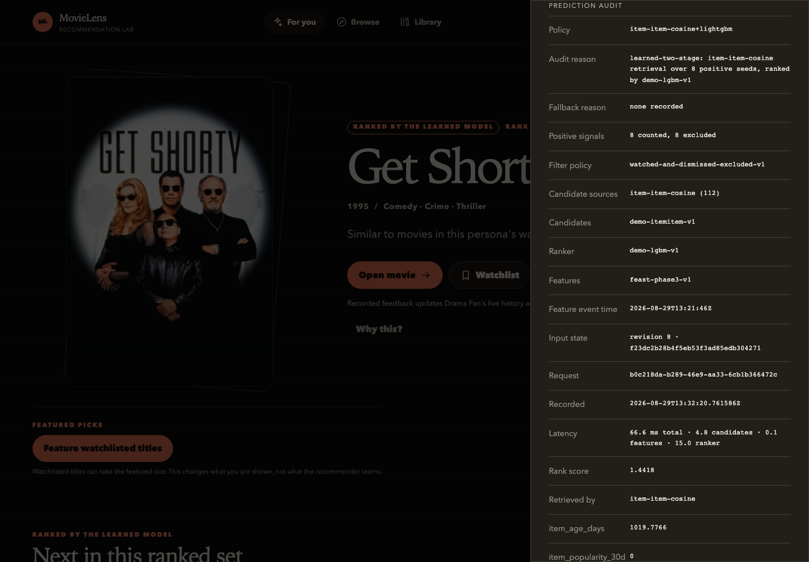

# MovieLens Two-Stage Recommender

A multi-tenant, authenticated two-stage recommender on MovieLens 25M: item-item retrieval into a LightGBM ranker, served by FastAPI behind Keycloak and PostgreSQL row-level security, with a k6-gated p99 and a Next.js product on top of the same API any other client would use.

[](https://github.com/kudratsingh/MovieLens-RecSys/actions/workflows/ci.yml)


[](#license)



Two tracks share this repository, and the models are the reason it exists. The modeling track starts
from the baselines the field measures against and builds the two-stage architecture the way production
recommenders are built — item-item retrieval, a two-tower with FAISS, a LightGBM LambdaRank ranker, and now a SASRec
transformer retriever that clears the retrieval gate but is not the served champion — and keeps
moving toward what the industry ships now. The next phase, under way as of 2026-10-05, rewrites that
transformer by hand, trains it larger, and compares every model fairly over three seeds and three
time windows ([the work orders](docs/model-planning/phase-a-work-orders.md);
[the modeling roadmap](docs/modeling-roadmap.md) is the ladder, rung by rung, each needing approval
before it starts). The engineering track is what makes those models usable by a real person rather than a
notebook: the tenant boundary the database enforces rather than the application, the feature-freshness
contract, the SHA-256-pinned serving bundle, the latency gate that measures the service instead of the
CI runner, and a serving contract that reports when the learned path did *not* run rather than quietly
taking credit for the fallback. Phase 3 built the harness that makes the product and the API real; serving is now parked where it
stands, and the modeling track is the main line of work.
Every significant decision, model choices included, is written down before the code that depends on it
lands — twenty-two ADRs, each with its alternatives analyzed and the signals that would reopen it.

## What is real today

**As of 2026-10-05.** Phases 1 and 2 are complete. Phase 3's engineering harness is on `main` and
runs locally through Docker Compose; the modeling track's next phase (Phase A, below) is in
progress, and serving is parked until it closes. What is real:

- **Authenticated serving.** Keycloak OIDC, one realm per tenant; the tenant comes from the token
  issuer, never from a client-declared claim. Every endpoint but `/healthz` and `/readyz` needs a token.
- **Tenant isolation the database enforces.** Forced row-level security on every tenant-scoped table,
  `SET LOCAL app.tenant_id` inside a per-request transaction, pgBouncer in transaction-pool mode so
  it cannot leak. The API refuses to boot if its engine can bypass RLS or the pooler is in session mode.
- **A learned two-stage path.** Item-item retrieval into a LightGBM LambdaRank booster, loaded once at
  startup by a private sidecar from a SHA-256-pinned manifest and checked against the champion the
  tenant is registered on, reading features from Feast over Redis. The same sidecar loads a schema 2
  bundle — a SASRec encoder with one ranker per route — and promoting one is a manual `make promote`;
  none has been promoted. Cold, unavailable or mismatched paths fall back to popularity and *say so*
  in the response.
- **Durable prediction audits.** Ranked items, scores, online feature values, model versions, which
  retriever and ranker route answered, structured fallback reason and per-stage timings, committed
  before the response is sent.
- **Transformer retrieval, measured.** SASRec ([ADR 0016](docs/adr/0016-sasrec-sequential-retrieval.md))
  retrieves 27.6% more of a warm user's next-28-day movies than item-item, and the corrected two-tower
  v2 ([ADR 0015](docs/adr/0015-two-tower-v2.md)) 28.1% more; retrained on SASRec's candidates with a
  ranker per route, the end-to-end NDCG@10 rises 10.4%. All of it one run per configuration on one
  protocol; the table is below.
- **Measured cold-start coverage.** A fixed-seed cohort of 2,000 synthetic users at history sizes
  0/1/3/10, scored per bucket by the same evaluation harness ([ADR 0011](docs/adr/0011-cold-start-coverage.md)).
  On its first run it falsified a claim: the offline candidate models fall back on "no history at
  all" rather than on ADR 0001's threshold, so a one-interaction user was handed item-item
  neighbours and did about a third as well as the fallback would have. That was closed on
  2026-08-30: the offline models now route on the threshold, and every run since records
  `synth_cold_routing_ok = true`.
- **The movie-discovery product.** Discover, Browse, movie detail, Library and Quick Picks behind one
  shell, ML evidence behind progressive disclosure. `/` serves it; the pre-redesign dashboard is
  retained at `/legacy` as a documented rollback.

**Nothing is deployed, and serving is parked.** The production target is specified, built and rehearsed end to end — one
Hetzner CX22 running `docker-compose.prod.yml` behind its own Caddy edge, GHCR images tagged with the
commit SHA, an SSH deploy that rolls back automatically when post-deploy verification fails — and the
whole release sequence has been driven from empty volumes in production mode on a laptop, in a
[14-step rehearsal](docs/production-readiness-review.md) that earned its keep: it was the first boot
of this codebase with `ENVIRONMENT != dev`, and every defect it exposed was fixed in the same branch.
**The machine has not been created, so there is no URL**, and the deploy and canary workflows stay
green no-ops until one is configured. Since that rehearsal, production has pointed at a full-data
served bundle (`infra/model-bundle-served/`) that is not yet published into the tree, so the stack
will not boot until `make serving-artifacts-publish` runs from an approved spec. On 2026-10-05 the
owner parked the whole serving line — the SASRec champion swap, its k6 run, the deploy, the
moderated frontend sessions — behind the modeling phase below. See
[ADR 0013](docs/adr/0013-production-deployment-target.md) and the
[deployment runbook](docs/deployment-runbook.md).

Still open in Phase 3, all parked rather than dropped: audit retention; `/me` ownership of the
subject-to-profile mapping; the ranker's training feature source, deferred as D-009 with its
alternatives costed; and the moderated frontend sessions the
[finish gate](docs/frontend/finish-gate-review.md) holds on, which a reviewer cannot substitute for.
The dev and staging Compose environments exist (`make up-dev`, `make up-staging`); staging is a thin
overlay on the production stack and, like production, has no host. The long form is in
[`docs/status/`](docs/status/README.md) and [`docs/README.md`](docs/README.md).

**Phase A, the current work.** The owner's 2026-10-05 brief sets nine work orders and five
conditions for done: the SASRec encoder uses no ready-made PyTorch transformer classes and
reproduces the old encoder's outputs; a larger hand-written model is trained and scored by the
same evaluation code as every baseline; each headline number is backed by three training runs and
more than one time window; one documented command reproduces each headline number; and this README
leads with the model comparison table. Out of scope until it closes: serving, deployment, latency
tests, the champion swap, the frontend, retriever mixing and Phases 4–6.
[`docs/model-planning/phase-a-work-orders.md`](docs/model-planning/phase-a-work-orders.md) is the
spec; [ADR 0020](docs/adr/0020-sasrec-v2.md)'s 2026-10-05 amendment records the decisions it
overrides, including the written definition of "from scratch".

## Quickstart

Docker Desktop or another Docker Engine with Compose v2. Ports 3001, 5432, 6379, 6432, 8000 and 8080
must be free. Python and Node are not needed on the host. The first start downloads base images and
builds the application images, and is substantially slower than later cached starts.

```bash
cp .env.example .env
make demo-up
make demo-seed
make demo-smoke
```

Open <http://localhost:3001> and sign in as **`demo` / `demo`** — a dev-only account seeded from
`infra/keycloak/realms/demo-realm.json`, labelled as such in the file and not a secret. The demo
stack runs with the auth bypass disabled, so this is the real authorization-code + PKCE flow.

It runs an isolated Compose project against the full 62,423-title MovieLens catalog, seeded from a
committed snapshot with 120 reviewed titles carrying posters and synopses on top, so the 25M dataset is not required. Warm personas are served the `item-item-cosine+lightgbm` policy with checksum-pinned model
versions; the Cold Start persona gets the explicit `popularity` fallback. `make demo-audits` prints
the newest durable audit rows — the exact predictions, features, versions and stage timings behind
what you just saw. TMDB posters are optional: set `TMDB_READ_ACCESS_TOKEN` in `.env` first, or leave
it empty for generated artwork. Walkthrough, reset and troubleshooting:
[`docs/demo-runbook.md`](docs/demo-runbook.md).

## Architecture

<picture>
  <source media="(prefers-color-scheme: dark)" srcset="docs/diagrams/online-request-path.dark.svg">
  
</picture>

**Online.** The tenant comes from the issuer that signed the token; the audience and authorized party
must be on an allow-list. A per-request transaction opens with `SET LOCAL app.tenant_id`, and one
read of `user_movie_state` returns positives and exclusions separately. Below ten positive signals
the request takes the popularity fallback. Above it, the private sidecar confirms it holds the
tenant's registered champion, retrieves candidates from that bundle's retriever — item-item in the
served bundle, a SASRec encoder over exact FAISS in a schema 2 bundle; only dismissals may drop a
seed — batch-reads eight features per candidate from Redis, and scores them with the ranker for that
route. Exclusions are re-applied at retrieval, at hydration, and in a final
fail-closed sweep. The audit row commits *before* the response goes out, so there is no 2xx for a
prediction that could still fail to become durable.

**Offline.** MovieLens 25M into Postgres, a temporal split, point-in-time features, both model
stages, then a SHA-256-pinned manifest binding the retriever, a ranker per route, the tenant and the
ordered feature contract. That bundle is baked into the sidecar image, so rolling back the model is rolling
back the image. The full walkthrough — with the tenancy, data-model, topology and CI diagrams — is in
[`docs/architecture.md`](docs/architecture.md).

## Measured

Latency is a gate, not a claim. The pinned k6 profile drives real Keycloak-authenticated warm, cold
and mixed traffic for 60 seconds and fails the build on **p99 ≥ 100 ms, any request error, any
response that is not correct, or fewer than 50 requests/second**. The thresholds have never moved.

| Measurement | When | Result |
|---|---|---|
| Accepted CI baseline | 2026-08-20 | p50 6.31 ms · p95 14.27 ms · p99 41.30 ms, 54.08 req/s over 3,301 requests, zero errors |
| Native thread teams pinned to 1 in the model server ([PR #69](https://github.com/kudratsingh/MovieLens-RecSys/pull/69)) | 2026-08-27 | p99 903.64 ms → **48.99 ms** at 0% host CPU steal, on the same unchanged gate |
| CI Postgres data directory moved to tmpfs ([PR #80](https://github.com/kudratsingh/MovieLens-RecSys/pull/80)) | 2026-08-28 | p99 230.74 ms → **24.41 ms**; WAL sync 3.15 → 0.21 ms per commit |
| The same gate at the production topology | 2026-08-27 | p50 6.85 ms · p95 9.47 ms · p99 12.93 ms, zero errors, zero dropped iterations |
| Rate limiter at its first defaults (120/min, burst 30) | 2026-08-27 | **37.9% of 301 requests refused** — keep-alive pins one client to one worker's bucket; defaults are now 600/min, burst 120 |
| The bucket moved into Redis, shared by every worker ([issue #70](https://github.com/kudratsingh/MovieLens-RecSys/issues/70)) | 2026-08-29 | One atomic `EVALSHA` per authenticated request; the limit now describes the service rather than one process, and an unreachable Redis costs **0.2 ms** and falls back rather than the 6.7 s redis-py's default retries spent first |

Sources: [ADR 0010](docs/adr/0010-synthetic-load-k6.md) (the first three),
[the readiness review's R-14](docs/production-readiness-review.md), and
[ADR 0014](docs/adr/0014-request-rate-limiting.md). Rows two and three are worth reading in full: in
both, the number moved because the *measurement* was wrong rather than the service, and the
resolution was to take the runner out of the measured path — never to relax a threshold.

**The data.** 25,000,095 ratings, 162,541 users, 59,047 movies ever rated (62,423 in catalog),
sparsity 0.2605%. The split is temporal and fixed: `T = percentile_disc(0.8)` lands on
2016-06-25 06:49:57 UTC, train is 20,000,075 rows (80.00% on the nose), holdout is 129,683 rows
across 28 days and 2,641 users, and the remaining 19.48% is sealed: the one final evaluation it
allows reads the 28 days after the holdout, once, and no decision may cite it afterwards. A
DVC-tracked TMDB snapshot (2026-09-05) resolves 98.5% of the catalog
([`docs/data/`](docs/data/tmdb-metadata.md)). [`docs/eda.md`](docs/eda.md) has the distributions
and what the long tail means for cold start.

**Offline model metrics.** `src/evaluation/` is the single source of truth — recall@500 for
retrieval, NDCG@10 end to end, sliced warm and cold per
[ADR 0001](docs/adr/0001-evaluation-protocol.md), one protocol hash across every row below, with
`EvalResult.k` stamped on every result so a retrieval number can never be read as an end-to-end
one. One full-25M run per configuration (seed 42, one machine — the
[experiment cost policy](CLAUDE.md)); every figure with its run, wall-clock and caveats is in
[`docs/results.md`](docs/results.md). Holdout: 1,931 warm users (ten or more training ratings),
710 cold. Cold is bit-identical down every row by construction: below the threshold, every model
serves the same popularity list.

| Stage | Model | Warm | Cold | Overall |
|---|---|---:|---:|---:|
| Retrieval, recall@500 | Item-item cosine (no learned parameters) | 0.3991 | 0.5263 | 0.4333 |
| Retrieval, recall@500 | SASRec v1 ([ADR 0016](docs/adr/0016-sasrec-sequential-retrieval.md)) | **0.5092** | 0.5263 | 0.5138 |
| Retrieval, recall@500 | Two-tower v2 ([ADR 0015](docs/adr/0015-two-tower-v2.md)) | **0.5113** | 0.5263 | 0.5153 |
| Two-stage, NDCG@10 | Item-item + LightGBM — the served bundle | 0.0728 | 0.5490 | 0.2008 |
| Two-stage, NDCG@10 | SASRec + a LightGBM per route — measured, not promoted | **0.1014** | 0.5490 | **0.2218** |

Three things the table says that a leaderboard would not. Both learned retrievers clear
[ADR 0004](docs/adr/0004-item-item-before-two-tower.md)'s retrieval gate — +27.6% and +28.1% warm
recall@500 over item-item, with paired-bootstrap lower bounds above +24% against a +3% bar — and
neither serves. A retriever that wins recall@500 can still lose end to end: retrained on SASRec's
candidates, one booster gained 26% warm NDCG@10 and lost 53% cold, because it then ranked the cold
users' popularity slate badly; the fix was a ranker per route, which is the last row, and it passes
ADR 0001's gate at +10.4% overall. And two results the table hides are recorded in full rather than
tidied away: the two-tower's earlier 0.0466, which this README reported as a loss, was a FAISS
row-mapping bug and not the model ([ADR 0006, 2026-09-06 note](docs/adr/0006-two-tower-retrieval-architecture.md));
and giving the ranker SASRec's own score as a feature bought +1.86% against a +3% stop rule, so the
attention ranker was not built ([ADR 0018](docs/adr/0018-sequence-aware-ranking.md)). Every one of
these numbers is one run on one 28-day window; Phase A's job is to put three seeds and three
windows under each before any of them is called a result. On the synthetic cold-start cohort,
item-item at history sizes 0/1/3/10 scores recall@500 0.4760 / 0.4600 / 0.4560 / 0.3900 with
`synth_cold_routing_ok = true` ([ADR 0011](docs/adr/0011-cold-start-coverage.md)).

## What makes this not a toy

Eleven bright-line rules, most of them enforced by a named CI job rather than by intention. The
[full list](CLAUDE.md) is in the project brief; these are the ones with mechanisms behind them:

| Job | What it proves |
|---|---|
| `feature-parity` | An offline-computed feature equals the online-served feature for the same key, against live Postgres and Redis. This is the bug that ruins most real recsys deployments. |
| `tenant-isolation` | Authenticates as tenant A against real Keycloak and RLS, fires every endpoint, and asserts no tenant B data surfaces. Cross-tenant leakage is the highest-severity bug class here. |
| `synthetic-load-smoke` | The 60-second k6 gate above, plus page-shaped per-step budgets and the non-latency reliability checks. Runs the job's Postgres on tmpfs, because every request commits an audit row and the runner's block device would otherwise sit inside every percentile it measures. |
| `serving-artifacts` | Rebuilds the demo serving bundle inside the image and diffs it against the committed one, so a training change that would silently move an artifact hash fails the build. |
| `realm-drift` | Exports both Keycloak realms from a fresh volume and diffs them against the committed seeds. |
| `browser-auth-e2e` | Real PKCE browser journeys with the dev bypass disabled, then LCP, CLS and time-to-acknowledgement in a throttled mobile browser. |
| `demo-compose` | Validates the demo, staging and production Compose models, and greps the rendered production model to assert `DEV_AUTH_BYPASS` appears nowhere in it. |
| `lint` / `frontend` | Ruff, Black, strict mypy, and the two contract drift checks: the committed OpenAPI document and the TypeScript types generated from it. |

`main` is protected: pull requests are required, force-pushes and deletions are blocked, and
`lint`, `test`, `feature-parity`, `tenant-isolation`, `synthetic-load-smoke`, `demo-compose`,
`frontend` and `browser-auth-e2e` are required status checks. Images publish to GHCR only after every
job is green.

## Product

  

The frontend is not an end-user product; it is the surface that makes the engineering visible.
**Discover** loads recommendations and watch history as independent regions, so a failed resource
never blanks the ones around it, and the policy label follows what the response reported rather than
an inference. **Browse** sits on a cursor-paginated catalog contract with URL-owned filters and
cursors bound to the query fingerprint — reuse one against a different query and it is a 400, not a
wrong page. The **movie page** carries TMDB detail over a local read model, so a poster grid never
fans out to TMDB per card. **Library** reads Rated, Watchlist and Seen independently, with optimistic
writes reconciled against the committed revision. **Quick Picks** advances only after the API
commits, because a one-card queue that rolled back would re-show a title the viewer already
dismissed. Throughout, the ML evidence — prediction audit, online feature values, the uncalibrated
rank score — is two deliberate actions away, never in the way of the first movie.

Product docs, design contracts and the testing strategy are in
[`docs/frontend/`](docs/frontend/README.md); the
[finish-gate review](docs/frontend/finish-gate-review.md) records the verdict per criterion and what
is still owed.

## Design decisions

| # | Decision |
|---|---|
| [0001](docs/adr/0001-evaluation-protocol.md) | Temporal split, recall/NDCG@10 reported warm and cold separately, +3% relative promotion gate on overall with per-slice non-regression; learned-route changes read warm-primary; the final evaluation reads a sealed 28 days once |
| [0002](docs/adr/0002-implicit-feedback-label.md) | Every rating is a positive interaction; the rating value leaves the modeling pipeline |
| [0003](docs/adr/0003-two-stage-architecture.md) | Two stages, because single-model global scoring misses the p99 SLO by orders of magnitude |
| [0004](docs/adr/0004-item-item-before-two-tower.md) | Item-item first, as the zero-learned-parameters baseline the two-tower must beat |
| [0005](docs/adr/0005-lightgbm-over-neural-ranker.md) | LambdaRank GBDT over a neural ranker; tabular point-in-time features are GBDT's home turf |
| [0006](docs/adr/0006-two-tower-retrieval-architecture.md) | History-based two-tower, sampled softmax with log-uniform correction, FAISS; the recorded runs use exact search, and a 2026-09-05 amendment voids the earlier negative results |
| [0007](docs/adr/0007-auth-provider-keycloak.md) | Self-hosted Keycloak, realm per tenant; tenant from the issuer, never from a claim |
| [0008](docs/adr/0008-multi-tenancy-rls.md) | Forced Postgres row-level security, `SET LOCAL` per request, pgBouncer in transaction mode |
| [0009](docs/adr/0009-feature-store-feast.md) | Feast with Postgres offline and Redis online; `tenant_id` a join key on every feature view |
| [0010](docs/adr/0010-synthetic-load-k6.md) | k6 as the SLO's only authority, with a measurement-validity rule instead of a movable threshold |
| [0011](docs/adr/0011-cold-start-coverage.md) | Fixed-seed synthetic cohorts at history sizes 0/1/3/10, scored per bucket |
| [0012](docs/adr/0012-browser-identity-feedback-and-online-freshness.md) | Actor separated from demo persona, durable movie state, commit before acknowledgement |
| [0013](docs/adr/0013-production-deployment-target.md) | One Hetzner CX22 running the same Compose file the rehearsal runs; cost is the deciding factor and says so |
| [0014](docs/adr/0014-request-rate-limiting.md) | Per-`(tenant, subject)` token bucket on the verified token, never on a client IP; one bucket in Redis for every worker, failing open onto a per-worker one |
| [0015](docs/adr/0015-two-tower-v2.md) | Two-tower v2: explicit logit temperature, mixed hard negatives, item side features. The corrected full run clears the retrieval gate at +28.1% warm recall@500 — measured, not promoted |
| [0016](docs/adr/0016-sasrec-sequential-retrieval.md) | SASRec: causal transformer retrieval over ordered history; +27.6% warm recall@500 over item-item, encoder p99 0.285 ms; promotion-eligible, swap parked |
| [0017](docs/adr/0017-content-based-cold-item-retrieval.md) | Content retrieval for the 3,376 never-rated titles; genres + year fired its own falsification condition, so TMDB metadata is the required next increment |
| [0018](docs/adr/0018-sequence-aware-ranking.md) | SASRec's score as ranker features first, target attention only on a named gap; +2.78% against a +3% stop rule, so DIN is not built |
| [0019](docs/adr/0019-multi-retriever-mixing.md) | A fixed-budget, attributed union of SASRec, two-tower and item-item candidates, then source-aware ranking. Approved 2026-09-15, deferred behind Phase A |
| [0020](docs/adr/0020-sasrec-v2.md) | SASRec v2: predeclared capacity, length and sampling cells, one run each; amended 2026-10-05 with the hand-written-encoder rule, the repair-the-fast-trainer-first order and the hardware ladder |
| [frontend/0001](docs/adr/frontend/0001-frontend-framework.md) | Next.js App Router with TypeScript and Tailwind |
| [frontend/0002](docs/adr/frontend/0002-movie-discovery-experience.md) | Poster-first discovery with ML evidence behind progressive disclosure |

[`docs/adr/README.md`](docs/adr/README.md) has the one-line decision for each, the status notes, and a
four-ADR reading order for a reviewer in a hurry.

## Stack

| Layer | Choice |
|---|---|
| Models | PyTorch (two-tower, SASRec; a CPU-only `torch` pin in the sidecar), LightGBM LambdaRank (ranker), `implicit` (ALS, cosine item-item) |
| ANN retrieval | FAISS-CPU; exact inner-product search for the recorded and loadable runs, IVF-Flat available |
| Data store | PostgreSQL, with Alembic migrations and pgBouncer in transaction-pool mode |
| Reproducibility | DVC for data (MovieLens 25M and the TMDB snapshot), MLflow for experiments and the registry |
| Feature store | Feast — Postgres offline, Redis online |
| Serving | FastAPI + Redis, with a private model sidecar |
| Auth | Keycloak OIDC, one realm per tenant |
| Tenant isolation | PostgreSQL forced row-level security |
| Frontend | Next.js 16 + TypeScript 5 + Tailwind; Vitest, Playwright, jest-axe |
| Load + reliability | k6 (pinned), with page-shaped budgets and a browser timing suite |
| Planned | Prefect orchestration (Phase 4), Evidently drift detection (Phase 5); Prometheus + Grafana are in the dev Compose stack, and nothing exports `/metrics` yet ([ADR 0013](docs/adr/0013-production-deployment-target.md)) |
| CI/CD | GitHub Actions — twelve jobs, GHCR `linux/amd64` images tagged with the commit SHA |
| Hosting (specified, not provisioned) | One Hetzner CX22 behind Caddy; SSH deploy with automatic rollback |

## Repository map

```
src/            auth/ · data/ · evaluation/ · features/ · models/ · serving/ · training/ · release/
alembic/        nineteen migrations: tenant roles, tenant_id, forced RLS, movie state, audits,
                champion columns, TMDB catalog, retrieval provenance
synthetic/      load/ (the k6 gate) · personas/ · smoke/ · tenant_isolation/ · cold_start/   → synthetic/README.md
web/            Next.js app, the one resource boundary, the one write path, four test layers
tests/          unit/ · feature_parity/ · learned_serving/ · tenant_isolation/ · integration/
infra/          images, Keycloak realms, pgBouncer, Caddy edge, host bootstrap  → infra/README.md
docs/           architecture, ADRs, API contract, frontend, runbooks, EDA      → docs/README.md
```

## Documentation

Read in this order:

1. [`docs/architecture.md`](docs/architecture.md) — the system on one page, with the rendered diagrams
2. [`docs/modeling-roadmap.md`](docs/modeling-roadmap.md) — the model ladder: where the models are, the rungs from here to a Netflix-class stack, which need approval next
3. [`docs/model-planning/phase-a-work-orders.md`](docs/model-planning/phase-a-work-orders.md) — the current phase: nine strict work orders, the decisions they rest on, and the run budget
4. [`docs/results.md`](docs/results.md) — every offline number with its run, date, machine and caveats; [`docs/experiments/`](docs/experiments/README.md) holds the configurations and gate verdicts behind them
5. [`docs/adr/README.md`](docs/adr/README.md) — every decision, its alternatives, and what would reopen it
6. [`docs/api/overview.md`](docs/api/overview.md) — every endpoint, and the committed OpenAPI contract beside it
7. [`docs/demo-runbook.md`](docs/demo-runbook.md) — running the whole stack from a clean checkout
8. [`docs/frontend/README.md`](docs/frontend/README.md) — the product docs, and the [finish gate](docs/frontend/finish-gate-review.md)
9. [`docs/production-readiness-review.md`](docs/production-readiness-review.md) — the gap review and the 14-step rehearsal record
10. [`docs/deployment-runbook.md`](docs/deployment-runbook.md) — the machine, DNS, secrets, first deploy, rollback, backups
11. [`docs/eda.md`](docs/eda.md) — MovieLens 25M: scale, sparsity, the long tail, the split as applied
12. [`docs/records/`](docs/records/) — dated documents kept for their reasoning and **not maintained**

## Development

```bash
make install          # Python deps
make infra-up         # Postgres, pgBouncer, Redis, Keycloak, MLflow, Prometheus, Grafana
make db-migrate       # alembic upgrade head

make lint             # ruff + black --check
make typecheck        # mypy, strict, on src/ synthetic/ notebooks/
make test             # pytest (make test-unit for the fast subset)
make serve            # uvicorn on :8000 with reload

make web-install      # then: make web-dev (:3001), web-test, web-e2e
make diagrams         # re-render docs/diagrams/ from source
```

Training entrypoints are `make train-popularity`, `train-cf`, `train-itemitem`, `train-last-item`,
`train-content`, `train-twotower`, `train-sasrec`, `train-ranker` and `train-sasrec-ranker`; each
logs to its MLflow experiment (UI on <http://localhost:5000>). `make gate` and `make gate-retrieval`
apply ADR 0001's and ADR 0004's gates to MLflow runs, and `make promote` registers a published
bundle as a tenant's champion.
`make data-download` and `make data-ingest` fetch and load the full 25M dataset, which the demo does
not need. Work goes on short-lived branches and merges by pull request — never a direct push to
`main` — with [Conventional Commits](https://www.conventionalcommits.org/) and a filled-in
[pull request template](.github/PULL_REQUEST_TEMPLATE.md).

## Security

Keycloak, JWT validation, RLS as the tenant boundary and a rate limiter are all real machinery here,
and a report against any of it is welcome. The disclosure process, the guarantees the project
considers highest-severity, and an explicit note on the dev-only credentials committed to this
repository are in [`SECURITY.md`](SECURITY.md).

## License

Published for portfolio visibility. No open-source license is granted for the code; all rights
reserved.

**Data.** The MovieLens-derived files in this repository — the committed catalog snapshot under
`synthetic/personas/` and the DVC-tracked dataset — are © GroupLens Research, University of
Minnesota, and are redistributed under the
[MovieLens license terms](https://files.grouplens.org/datasets/movielens/ml-25m-README.html),
not under the all-rights-reserved notice above. F. Maxwell Harper and Joseph A. Konstan, "The
MovieLens Datasets: History and Context", ACM TiiS 5(4), 2015. Movie metadata and posters come from
[TMDB](https://www.themoviedb.org/) under its API terms; this project is not endorsed or certified
by TMDB.
