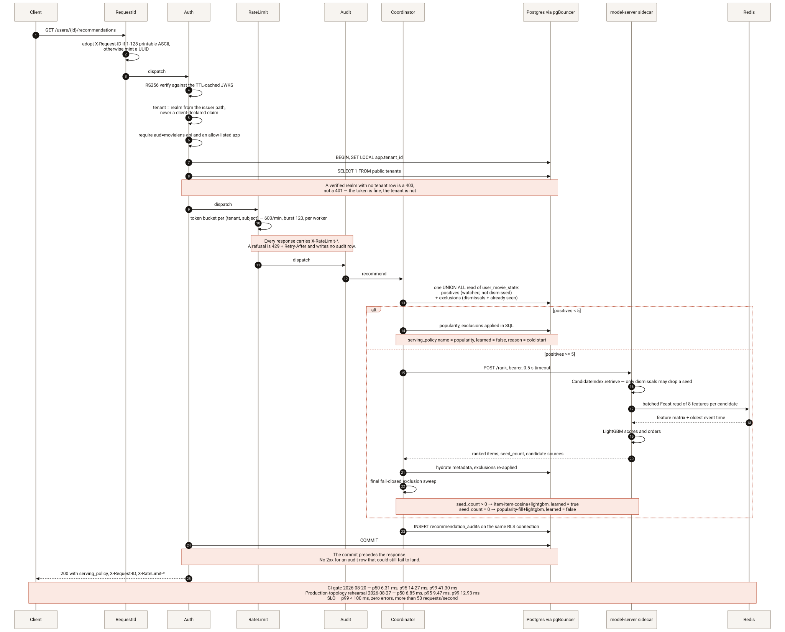

# Architecture

A multi-tenant, authenticated two-stage movie recommender, built on MovieLens
25M. A request arrives carrying a token; the tenant is derived from who signed
that token; a candidate generator retrieves from a precomputed index; a LightGBM
ranker scores those candidates against features read from Redis; the response
comes back with an explicit statement of which policy served it, and a durable
audit row is committed before the answer is sent. A Next.js product sits on top
of the same authenticated API any other client would use.

The interesting part of this project is not the model. It is the engineering
around it: the isolation boundary, the feature-freshness contract, the artifact
pinning, the latency gate, and the deployment. Those are what this document
describes.

**What is running right now: nothing.** The production target is specified,
built and rehearsed end to end — one Hetzner CX22 running `docker-compose.prod.yml`
behind its own Caddy edge, a deploy workflow that ships on a green CI run and
rolls back automatically on a failed verify — but the machine has not been
created, so there is no URL. Everything below is on `main` and runs locally
through Docker Compose. Where something is planned rather than built, this
document says so in the same sentence.

---

## The whole system

<picture>
  <source media="(prefers-color-scheme: dark)" srcset="diagrams/system-overview.dark.svg">
  
</picture>

Two paths run through it.

**The offline path** turns MovieLens into a serving bundle: ingest into Postgres,
a time-respecting split, point-in-time features into `feature_store.*`, a
candidate generator and a ranker, and a manifest that pins each artifact by
SHA-256. The bundle is committed to the repository and baked into an image. It
is run by hand today — there is no orchestrator on `main`.

**The online path** answers a request: request-id, auth, rate limit, audit, then
a coordinator that reads the user's durable movie state, decides between the
learned two-stage path and the popularity fallback, and calls a private sidecar
that owns retrieval, the online feature read and the ranker.

The split between the API and the sidecar is deliberate. The API image never
imports Feast, pandas or LightGBM; the sidecar never terminates a public
request, never holds a user token, and publishes no port. That keeps the image
that faces the internet small and keeps the model runtime's dependencies out of
the request-handling process.

---

## One request

<picture>
  <source media="(prefers-color-scheme: dark)" srcset="diagrams/online-request-path.dark.svg">
  
</picture>

Four pieces of middleware wrap every request, outermost first
(`src/serving/app.py`):

1. **RequestId** adopts a well-formed inbound `X-Request-ID` — 1 to 128
   printable ASCII characters, space excluded so nothing can smuggle a newline
   into a log line — and mints a UUID otherwise. It echoes the value on every
   response, including a 401, which is why it sits outside auth.
2. **Auth** verifies the token, derives the tenant, opens the request
   transaction and sets `app.tenant_id` on it.
3. **RateLimit** applies a token bucket per `(tenant, subject)`. It is installed
   everywhere except `environment == "dev"`.
4. **Audit** matches exactly one route shape — `GET /users/{id}/recommendations` —
   and writes the prediction log row.

The coordinator reads positives and exclusions from `user_movie_state` in a
single `UNION ALL` round trip, written that way so each side can use its own
partial index. Positives are watched-and-not-dismissed titles, newest first,
because that is the order retrieval walks them in. Exclusions are dismissals
plus everything already seen.

If there are fewer than five positive signals, the request takes the popularity
fallback. Otherwise the coordinator asks the sidecar for
`max(100, limit × 10)` candidates over a 0.5-second timeout. The sidecar
retrieves from the item-item index, batch-reads eight features per candidate
from Redis through Feast, scores with LightGBM, and returns the ranked list with
its own per-stage timings and attribution.

**Exclusions are re-applied at every stage that could reintroduce a title** —
retrieval, the sidecar's ranking loop, the client's contract check, the
hydration SQL, and a final fail-closed sweep — because the alternative is
showing someone a movie they explicitly dismissed, and each of those layers has
a different reason to be stale.

The audit row is inserted on the same RLS-bound connection as everything else,
and **the transaction commits before the response is returned**. There is no
2xx for a mutation or an audit row that could still fail to become durable. A
commit failure discards the handler's response and answers 500.

### What the numbers are, and when they were measured

| Measurement | Result | Source |
|---|---|---|
| CI gate, accepted baseline 2026-08-20 | p50 6.31 ms, p95 14.27 ms, p99 41.30 ms, 54.08 req/s over 3 301 requests | [ADR 0010](adr/0010-synthetic-load-k6.md) |
| Production-topology rehearsal 2026-08-27 | p50 6.85 ms, p95 9.47 ms, p99 12.93 ms | [production-readiness-review.md](production-readiness-review.md) |
| SLO | p99 < 100 ms, zero errors, more than 50 requests/second | [ADR 0010](adr/0010-synthetic-load-k6.md) |

Two of the regressions that gate found are worth reading, because both looked
like a slow model and were neither:

- The four sidecar workers were each letting LightGBM's OpenMP and BLAS size a
  thread team to the whole host, so process parallelism multiplied by native
  parallelism into a periodic backlog: **p99 903.64 ms at 0% host CPU steal**.
  Pinning `OMP_NUM_THREADS`, `OPENBLAS_NUM_THREADS`, `MKL_NUM_THREADS` and
  `VECLIB_MAXIMUM_THREADS` to 1 brought the same unchanged gate back to
  **p99 48.99 ms**. No threshold, timeout or worker count moved.
- Because every request commits a durable audit row before it answers, one
  `fdatasync` sits inside the p99 — and a rented CI runner's block device was
  in that path, at **3.15 ms per commit**. Moving the job's Postgres data
  directory to tmpfs took it to **0.21 ms** and the gate's p99 from
  **230.74 ms to 24.41 ms**. Durability semantics did not change:
  `synchronous_commit` stays on and the commit still precedes the response.
  What a commit costs on a real disk is measured in production instead.

A breached window may be re-measured exactly once, and only when the host's own
CPU-steal record shows the runner was preempted. That is a measurement-validity
rule, not a relaxed threshold, and the thresholds have never moved.

### Which policy served it

<picture>
  <source media="(prefers-color-scheme: dark)" srcset="diagrams/serving-policy-decision.dark.svg">
  
</picture>

Every recommendation response carries a `serving_policy` object: the policy
name, a `learned` boolean, the positive-signal count and the threshold it was
compared against, a structured reason, the score scale, the filter policy, and
the excluded count. The frontend labels the response from that flag rather than
inferring it, and the same values land in the audit row.

The `unseeded-retrieval` case exists because of a bug worth keeping visible.
The exclusion set the coordinator sends the sidecar necessarily contains the
user's own watched titles, and retrieval was using it to filter the *seed* set
as well as the output — so every warm persona was in fact being served the
index's popularity fill, scored by LightGBM, while the response claimed
`learned: true` over zero seeds. Dismissals now travel on their own input as the
only signal that may drop a seed, `seed_count` reports the seeds retrieval
actually used rather than the ones offered, and a retrieval no seed reached
reports itself as `popularity-fill+lightgbm` with `learned: false` instead of
borrowing the learned label.

---

## Tenancy and auth

<picture>
  <source media="(prefers-color-scheme: dark)" srcset="diagrams/tenancy-and-auth.dark.svg">
  
</picture>

**Auth** is self-hosted Keycloak with one realm per tenant
([ADR 0007](adr/0007-auth-provider-keycloak.md)). The tenant is the realm in the
token's `iss` claim, and the issuer is checked against the configured public
base URL before it is trusted — so the tenant comes from whoever signed the
token, never from a claim the client controls. Tokens must carry
`aud=movielens-api` and an `azp` in an explicit allow-list. Signing keys come
from a JWKS cache with a 300-second TTL that force-refreshes once on a key-id
miss, so a rotation does not need a restart. Every endpoint except `/healthz`
and `/readyz` requires a valid token; both exceptions serve no tenant or user
data and, in production, publish no port.

**Isolation** is Postgres row-level security
([ADR 0008](adr/0008-multi-tenancy-rls.md)). Seven tables carry `tenant_id` with
`FORCE ROW LEVEL SECURITY` and a policy of
`tenant_id = current_setting('app.tenant_id', true)` on both `USING` and
`WITH CHECK`. The auth middleware opens a transaction and issues
`SET LOCAL app.tenant_id` before any handler runs, so the database — not
application filtering — is the enforcer of last resort. A verified realm with no
row in `public.tenants` is refused with a 403: the token is fine, the tenant is
not registered.

Three things hold that up:

- **pgBouncer runs in transaction pool mode.** In session mode a `SET LOCAL`
  could outlive its request on a returned connection. `src/serving/startup_checks.py`
  opens the pooler's admin console at boot and refuses to start if the mode is
  anything else.
- **The serving role cannot bypass RLS.** The same startup check refuses to boot
  if the connected role holds `BYPASSRLS` or `SUPERUSER`. `app_user` is the only
  role that serves a request, and the only one that reaches Postgres through the
  pooler's `movielens_app` forced-user alias.
- **Two canaries.** `tests/tenant_isolation/` runs 23 cross-tenant assertions
  against the real Compose stack on every CI run; `synthetic/tenant_isolation/remote_canary.py`
  is the same idea as a deployable probe, which is why it lives under
  `synthetic/` rather than `tests/` — the API image ships one and not the other.

Persona impersonation is gated separately. Selecting a user other than your own
subject requires either the confidential service client or a `demo-impersonator`
realm role; `/whoami` is the only authenticated route without that gate.

**Rate limiting** ([ADR 0014](adr/0014-request-rate-limiting.md)) is a token
bucket keyed on `(tenant, subject)` from the verified token rather than on a
client address, because behind an edge every request comes from a proxy. Two
limits are written down rather than hidden. The first defaults — 120/minute with
a burst of 30 — refused **37.9% of one subject's 301 canary requests**, because
the bucket lives in the worker process and keep-alive pins a client to one of
them; the defaults are now 600/minute with a burst of 120 and a Redis-backed
shared bucket is the named follow-up. And the limits are global rather than
per-tenant, because the per-tenant quota column belongs with the tenant-config
work that Phase 6's routing needs anyway.

---

## Features, artifacts, and why the bundle is baked

<picture>
  <source media="(prefers-color-scheme: dark)" srcset="diagrams/offline-training-to-serving.dark.svg">
  
</picture>

**The split respects time** ([ADR 0001](adr/0001-evaluation-protocol.md)). The
cutoff `T` is the 80th-percentile timestamp — 2016-06-25 — and train lands on
exactly 80.00% of rows. Holdout is the following 28 days: 129 683 interactions
across 2 641 users. Everything at or after `T + 28d` is test. Ties go to the
later slice. There are no random splits on this data anywhere.

The dataset itself is 25 000 095 ratings from 162 541 users over 59 047 rated
movies, at 0.2605% density ([`eda.md`](eda.md)).

**Features** are declared to Feast ([ADR 0009](adr/0009-feature-store-feast.md))
over three Postgres tables, with `tenant_id` as a join key on every view, and
materialized into Redis as tenant-keyed snapshots. The ranker consumes eight of
them in a fixed order that `src/feature_contract.py` owns, so training, the
manifest and the sidecar cannot disagree about column order without failing
loudly.

**Offline/online parity is tested, not assumed.** `tests/feature_parity/` runs
in CI against live Postgres and Redis and asserts the offline value equals the
online value for the same key. This is the bug class that quietly ruins most
recommender deployments, and the only way to know it has not happened is to
check.

**Serving artifacts are pinned by content.** A `ServingManifest` binds the
item-item index, the LightGBM booster, the tenant, and the ordered feature
contract, with a SHA-256 for each artifact. The bundle is committed at
`infra/model-bundle/` and **baked into the sidecar image at build time**, along
with the applied Feast registry. Three consequences follow, and all three are
the point:

- Rolling back the model is rolling back the image. There is no second
  mechanism to get wrong at 02:00.
- The sidecar verifies every hash when it loads, then warms itself through a
  real retrieve → feature read → rank before it joins the accept loop, and its
  `/healthz` returns 503 until that finishes. Warmth is by construction rather
  than by luck, and a warm-up that produces an all-zero feature matrix is
  treated as a failure rather than a fast success.
- CI's `serving-artifacts` job rebuilds the bundle in the image and diffs it
  against the committed one, so a change to training that would silently move
  the artifacts fails the build instead.

**No offline metric values appear in this repository.** Recall@500 and NDCG@10
are what the harness computes and what MLflow records, but no run's numbers are
committed, so none are quoted here or drawn on any diagram.

---

## The data model

<picture>
  <source media="(prefers-color-scheme: dark)" srcset="diagrams/data-model.dark.svg">
  
</picture>

Fourteen migrations, and the shape is worth a paragraph each for the three
tables that carry the design.

**`user_movie_state`** is the current state of one user's relationship to one
movie: watched, rated, watchlisted, dismissed, plus a `state_version` the write
path uses for optimistic concurrency. Its CHECK constraints encode the semantics
rather than leaving them to application code — a rating implies a watch, and
watchlisted and dismissed are mutually exclusive. It was backfilled from
`ratings` without modifying a single imported row, because the MovieLens data is
a dataset and not a user's opinion.

**`user_feedback_events`** is the append-only log beside it, attributed to the
OIDC subject that made the change rather than to the persona it was made
against. Append-only is enforced by grant: neither runtime role has `UPDATE` or
`DELETE` on it.

**`recommendation_audits`** is the prediction log. Every recommendation writes
one row carrying the exact predictions and the feature values behind them, the
four per-stage latencies, the model, candidate, ranker and feature versions, the
policy and its structured reason, the input-state revision and hash, the
exclusion hash, the feature event time, and the correlation id. `request_id` is
the row's own identity and `correlation_id` is the echoed `X-Request-ID`, kept
separate so a replayed header cannot collide with an existing row's primary key.

The `feature_store.*` tables are outside RLS on purpose: `app_user` has no grant
on them at all, because online reads go through Redis and nothing serving a
request has any business reading the offline store. `movies`, `links`,
`movie_catalog_metadata` and `public.tenants` are shared by design — a movie
catalog is not tenant data, and the tenant registry is by definition the thing
RLS is looking things up in.

---

## The frontend

The Next.js app is a real client against the same authenticated API as anything
else, and it is a portfolio surface rather than a product: it exists to make the
ML engineering visible. It is poster-first movie discovery
([frontend ADR 0002](adr/frontend/0002-movie-discovery-experience.md)) —
Discover, Browse, movie detail, Library and Quick Picks behind one shared shell
— with the ML evidence (the serving policy, the prediction audit, the online
feature values) behind progressive disclosure rather than on the page by
default. `/` serves that product to a signed-in viewer; the pre-redesign
dashboard survives at `/legacy` as a documented rollback until the finish gate
records a participant-backed pass.

The boundaries are the load-bearing part. The browser never holds an API token:
Auth.js runs the real authorization-code-plus-PKCE flow and keeps tokens in an
encrypted HttpOnly server session, and seventeen BFF route handlers are the only
things that talk to FastAPI. Behind them, `web/lib/resources/` is the one
server-owned client every product route reads through — per-resource timeout
budgets, `X-Request-ID` generation and echo, `private, no-store` on every
personalized response, and a caller-supplied bearer refused at the BFF edge
*and* again in the browser reader rather than silently dropped. The retained
`/legacy` dashboard's rating route predates that boundary and still calls the
API directly, which is one of the things retiring `/legacy` closes. Its eight-state model renders through one region
component, so a resource that fails never blanks the regions around it. Writes
go through exactly one path, `web/lib/movie-state/`: the transition table
written once, an idempotency key bound to the intent, `expected_revision` on
every request, a 409 that triggers a canonical re-read and one replay at that
revision, a 422 with `code: transition_refused` that earns the same re-read but
no replay — a rule about state, so being refused proves the control was stale,
and asking again would only ask the same rule — and a rollback that announces the
restore and walks focus back. That
consolidation was not tidiness — the previous copies had already diverged, and
only one of them turned a conflict into a correction rather than telling the
viewer to reload. The route map is in
[`frontend/frontend-system.md`](frontend/frontend-system.md).

---

## Delivery

<picture>
  <source media="(prefers-color-scheme: dark)" srcset="diagrams/ci-cd-pipeline.dark.svg">
  
</picture>

Twelve CI jobs. Beyond the usual lint, type-check and unit suite, the ones that
carry weight are `feature-parity` (offline equals online against live stores),
`tenant-isolation` (23 cross-tenant canaries on the real Compose stack),
`synthetic-load-smoke` (60 seconds of k6 at 55 arrivals per second against a
bypass-disabled service, with Postgres on tmpfs so the runner's disk is out of
the measurement, and evidence uploaded), `demo-compose` (every Compose model
resolves, the API image is under 400 MB, the rendered production model contains
no dev bypass), `browser-auth-e2e` (bypass-disabled browser journeys plus real
browser timing) and `serving-artifacts` (rebuild the bundle, diff it against the
committed one).

Only after all eleven are green does `publish-images` push seven images to GHCR
for `linux/amd64`, tagged with the commit SHA. The box never builds.

Deployment then re-checks that work rather than trusting it: the deploy
workflow's gate job **re-asserts each CI job by name on that SHA** — ten
required, and two path-gated jobs whose skip is accepted with a warning — before
it opens an SSH connection with a `known_hosts` pinned from a secret.
`infra/deploy/deploy.sh` records the current release as the previous one, pulls
at the SHA, runs the release jobs, brings the stack up and runs `make prod-verify`.
**If verification fails it redeploys the previous release and verifies again**,
and reports `ROLLBACK-OK` — while still failing the job, because that commit did
not ship.

<picture>
  <source media="(prefers-color-scheme: dark)" srcset="diagrams/production-topology.dark.svg">
  
</picture>

The target is one Hetzner CX22 ([ADR 0013](adr/0013-production-deployment-target.md)),
and cost is the deciding factor and says so: **≈€4.50/month against a measured
≈$27 on a PaaS** for the same ≈2.0 GB idle footprint. The single-host
consequences are stated rather than glossed — one failure domain, a deploy is a
brief outage, patching is the owner's, and off-box backups are the recovery
story.

Exactly two arrows cross the machine: 443/80 to the Caddy edge, which routes
precisely two public hostnames, and key-only SSH on 22 from GitHub Actions.
Everything else — both Postgres servers, Redis, pgBouncer, Keycloak, the API,
the sidecar, the feature server and the web app — lives on the host's private
Docker network and publishes nothing. `infra/host/bootstrap.sh` turns a stock
Ubuntu box into that host idempotently, and three systemd units run the stack at
boot, a nightly encrypted backup to a bucket at a different provider, and a
weekly image prune.

A scheduled canary runs `make prod-verify` every thirty minutes. It records p99
without a verdict, deliberately: k6 there would share two vCPUs with the service
it is measuring, so **the CI gate remains the SLO's only authority**. The canary
is a green no-op until a host is configured. The full sequence is in the
[deployment runbook](deployment-runbook.md).

---

## What is deliberately not built yet

This is scope, not apology. Each of these has a place in the plan and none of
them is drawn on a diagram as though it exists.

- **Per-tenant champion routing.** The tenant router resolves an id, a display
  name and a Redis prefix. There are no champion-model-version, quota or A/B-seed
  columns on `public.tenants` yet, and the sidecar is pinned to one tenant by its
  manifest — a second serving tenant is a second process. That is Phase 6's
  work, and it is what unblocks champion/challenger and shadow deploys.
- **Orchestration.** The offline path is a set of entrypoints run by hand.
  Prefect flows, an evaluation gate wired into promotion, and idempotent
  retraining are Phase 4.
- **Drift detection.** Evidently, the feature-distribution dashboards, and the
  synthetic drift cohort that proves an alert fires are Phase 5.
- **A `/metrics` endpoint.** Prometheus and Grafana are in the dev stack and are
  deliberately absent from production; nothing exposes a scrape target, and
  ADR 0013 records that as a decision rather than an omission. The production
  health signal today is the verify matrix and the audit-table SLI it prints,
  plus an external uptime check that is still owed.
- **Structured JSON logging.** The convention is written down; the serving path
  does not yet emit it.
- **`docker-compose.{dev,staging}.yml`.** The production file landed with the
  deployment work and doubles as its own local rehearsal. Dev and staging
  splits remain.
- **Generic request audits.** The audit middleware matches only the
  recommendations route. Every other authenticated endpoint writes no audit row,
  in production too, and the runbook says so plainly rather than letting the
  non-negotiable's wording read as a description of what is running.
- **Cold-start cohorts.** [ADR 0011](adr/0011-cold-start-coverage.md) specifies a
  fixed-seed synthetic cohort at history sizes 0/1/3/10 scored per bucket. The
  methodology is pinned; the harness is not built. Cold-start *handling* exists
  and is exercised — a persona with fewer than five positive signals takes the
  fallback and says so — but its coverage is not yet a metric line.
- **Feast-backed training rows.** Training still builds features with the
  point-in-time `FeatureIndex` rather than Feast's historical retrieval, so
  parity is proven on the served snapshot and not yet on training rows.
  Relatedly, training-time candidate generation applies no exclusions, so the
  ranker learns over a candidate mix serving no longer produces — that needs
  either the serving filter applied offline or a written argument for why the
  difference is acceptable.

---

## Where to read next

- [`adr/README.md`](adr/README.md) — every decision, with its alternatives and
  the signals that would reopen it. Fourteen backend ADRs and two frontend ones.
- [`deployment-runbook.md`](deployment-runbook.md) — the machine, DNS, host
  bootstrap, secrets, the one-time SQL, the first deploy, verify, rollback,
  backups and the restore drill.
- [`production-readiness-review.md`](production-readiness-review.md) — the
  pre-deployment gap review and the 14-step rehearsal record, including the
  defects the first non-dev boot of this codebase found.
- [`demo-runbook.md`](demo-runbook.md) — running the whole stack from a clean
  checkout.
- [`api/README.md`](api/README.md) — the generated OpenAPI contract for the
  authenticated surface.
- [`diagrams/README.md`](diagrams/README.md) — how the diagrams above are
  produced, and the rule that the code settles any disagreement with them.
